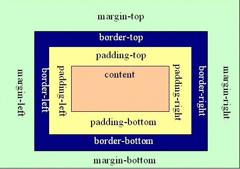

# NOTE

BRICKEA

2018年8月14日

---

## CSS 我们能够以不同的方法为链接设置样式。

### 设置链接的样式

能够设置链接样式的 CSS 属性有很多种（例如 color, font-family, background 等等）。

链接的特殊性在于能够根据它们所处的状态来设置它们的样式。

链接的四种状态：

* a:link - 普通的、未被访问的链接
* a:visited - 用户已访问的链接
* a:hover - 鼠标指针位于链接的上方
* a:active - 链接被点击的时刻

**注意**

当为链接的不同状态设置样式时，请按照以下次序规则：

* a:hover 必须位于 a:link 和 a:visited 之后
* a:active 必须位于 a:hover 之后

---

## CSS 中margin和padding的区别

CSS中margin和padding的区别如下：

* margin是指从自身边框到另一个容器边框之间的距离，就是容器外距离。

* padding是指自身边框到自身内部另一个容器边框之间的距离，就是容器内距离。

从图示中看得就会比较直观，可以很容易理解了



---

## CSS 中的>号 +号 nth-child伪类用法

这些是CSS3特有的选择器，A>B 表示选择A元素的所有子B元素。

与A B的区别在于，A B选择所有后代元素，而A>B只选择一代。

另外：没有<的用法。

A+B表示HTML中紧随A的B元素。

nth-child是个伪类的用法，如p:nth-child(2)就表示在p的父元素中选择位居第二位的p

---

## html中的alt属性

如果无法显示图像，浏览器将显示替代文本

```html

```

此外，当用户把鼠标移到图像上方，最新的浏览器会在一个文本框中显示描述性文本。